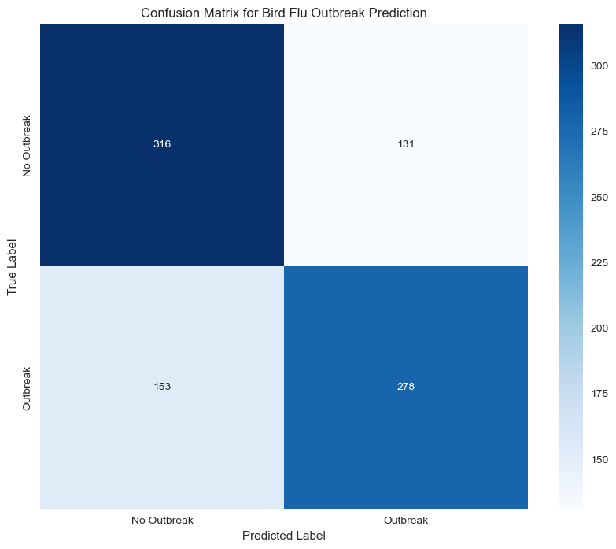
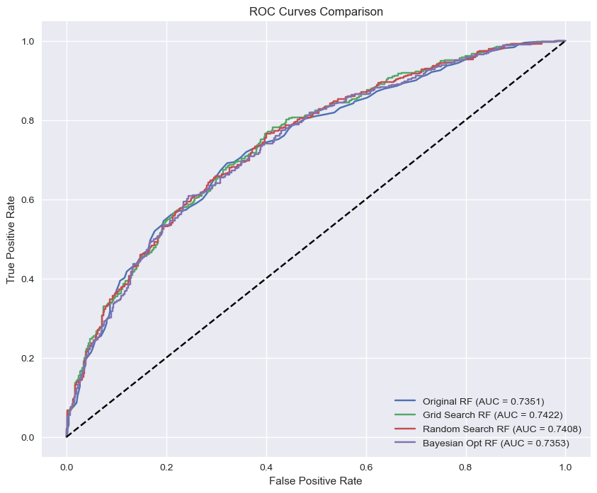
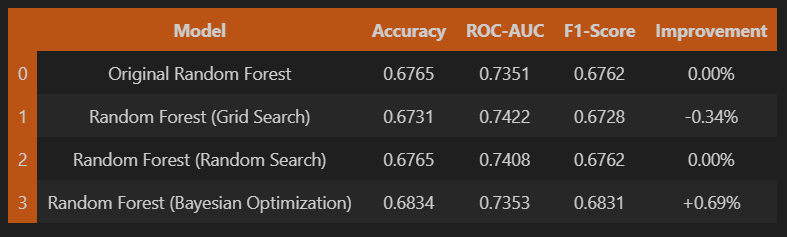
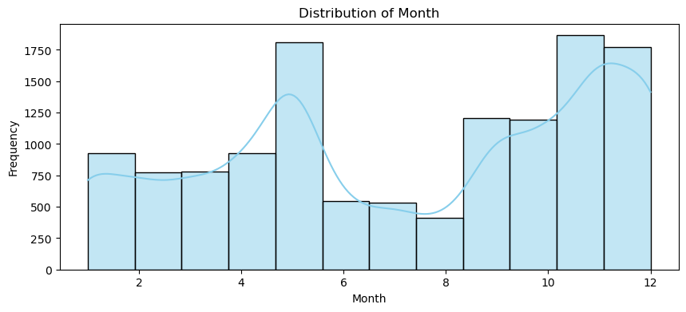
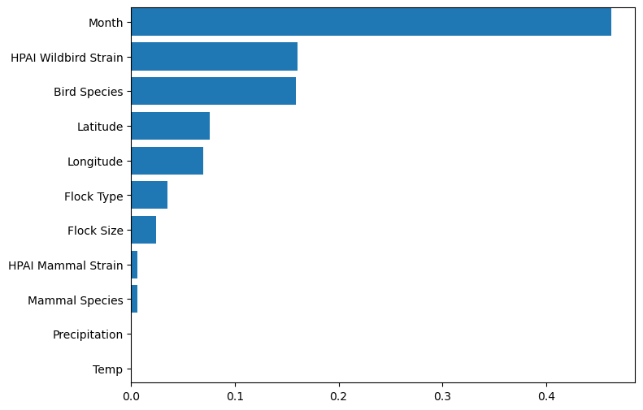
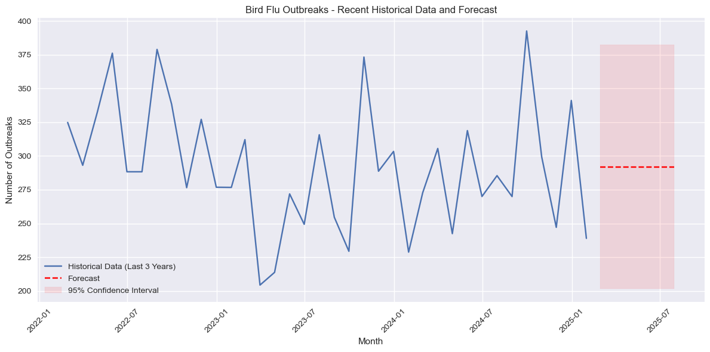
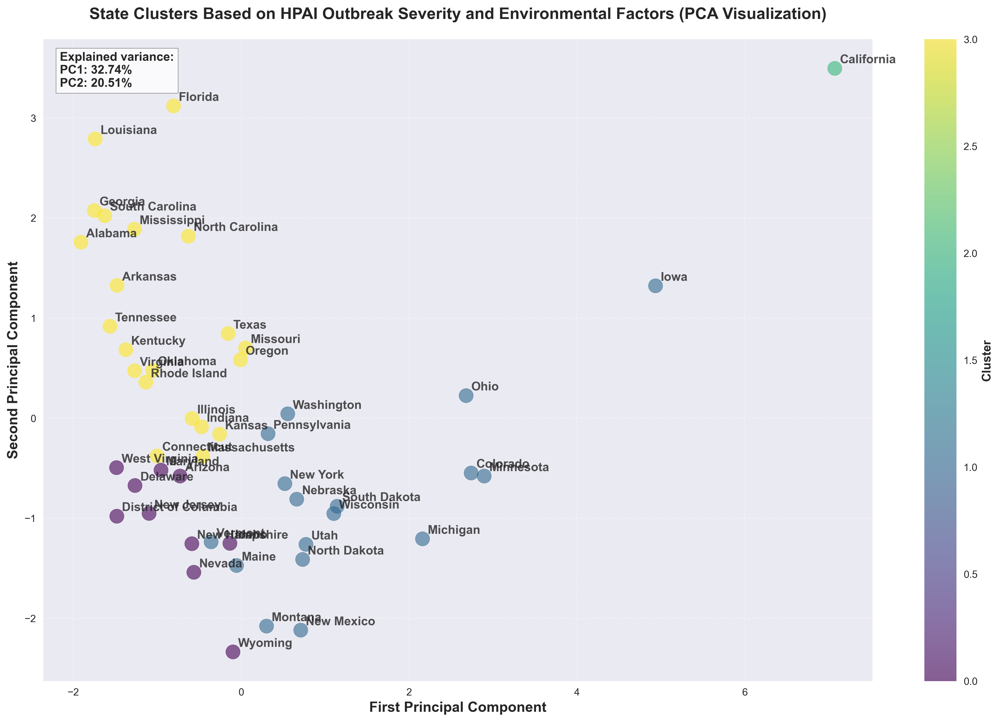

## 📌 AI/ML Bootcamp Project 2: Project Overview
Bird flu is currently spreading in the US, posing a significant **public health risk** due to its **zoonotic potential** and causing economic damage to the poultry industry. This project aims to **analyze the severity of different bird flu strains using genomic data**.

### **Key Research Questions:**
1. **Can we predict future outbreaks of Avian flu based on historic data using a times series model?**
2. **Can we group related outbreaks by their qualities across the United States?**

### Why Machine Learning?
Machine learning helps us process large datasets efficiently while improving accuracy. We will apply:
- **K-Means Clustering** & **PCA (Principal Component Analysis)** for data exploration.
- **Classification models** (Random Forest, Logistic Regression) for sequence classification.
- **Optimizations** using   - Grid Search CV, Randomized Search CV, and Bayesian Optimization.

## 📌 Data Collection & Sources
We have gathered data from multiple reputable sources, ensuring that our analysis is based on **official and scientifically validated data**. The process of data collection involved **extracting structured datasets from government and health organization portals, preprocessing them for inconsistencies, and integrating them into our analysis pipeline.**

### Primary Data Source:**
- Centers for Disease Control and Prevention (CDC)** - [Bird Flu Situation Summary](https://www.cdc.gov/bird-flu/situation-summary/index.html)
  - Data includes **geographical spread**, **infection rates**, and **clinical outcomes** of bird flu strains across different states.
  - We extracted reported cases of **H5N1 and other avian influenza strains** from CDC's public datasets.

### Secondary Data Sources:**
- Global Initiative on Sharing All Influenza Data (GISAID)** - [https://gisaid.org/](https://gisaid.org/)
  - Provides genomic sequencing data** of flu strains, essential for understanding viral mutations.
  - Data was retrieved through API requests and structured CSV formats.

- World Health Organization (WHO)** - [https://www.who.int/](https://www.who.int/)
  - Used for global perspective on bird flu trends** and **cross-country comparisons**.
  - WHO publications were parsed for trend reports and structured into time-series datasets.

- Data.gov (US Government Open Data Portal)** - [H5N1 Dataset Collection](https://catalog.data.gov/dataset/?q=H5N1+&sort=views_recent+desc&tags=avian-influenza&ext_location=&ext_bbox=&ext_prev_extent=)
  - Provided historical records of avian flu outbreaks, economic impacts on the poultry industry, and state-wise prevalence.
  - Data was cleaned using Python’s **Pandas library** to remove inconsistencies and missing values.

## 📌 Data Files in This Repository
We have uploaded several datasets and processing notebooks that document each step of our analysis:

| File Name | Description |
|-----------|-------------|
| **HPAI Detections in Mammals.csv** | H5N1 casses in Mammals
| **backyard_flock_old.csv** | Data on flu outbreaks in **commercial vs backyard poultry flocks**, extracted from **CDC reports**. |
| **hpai-wild-birds.csv** | High Pathogenic Avian Influenza (HPAI) cases in **wild birds**, sourced from WHO's open-access dataset. |
| **weather.csv** | Weather realted datasets. |
| **proj2_birdflu_analysis.ipynb** | The main project notebook. |
| **US Counties.csv** | US State and County dataset with Latitude and Longitude values. |
| **geo-data.csv** | US State and County census data. |
| **hpai-flocks.csv** | Data on flocks (non-wild birds) and Bird Flu. |
| **hpai-livestock.csv** | Data on cattle and similar livestock. |
| **hpai-mammals.csv** | Data on various mammals and outbreak data. |

 

## 📌 Binary Classification with Random Forest Classifier

This analysis tackles a binary classification problem to predict bird flu outbreaks using a Random Forest Classifier. Various hyperparameter tuning methods are explored to optimize the model performance.

### Code & Data Processing:
- The notebook begins by importing the necessary libraries and reading the dataset.
- It preprocesses weather and geographic features and then balances the data by sampling non-outbreak cases.
- A train-test split is performed for subsequent model evaluation.

**Datasets:**
1. Current outbreak data on wild birds, Commercial Flocks, livestock, and Mammals.
2. US county data with latitudes and longitudes.
3. US Weather data based on State and County.

### Modeling & Tuning:
- The core model is a Random Forest Classifier.
- Three separate tuning approaches are implemented:
  - **Grid Search CV**
  - **Randomized Search CV**
  - **Bayesian Optimization**
- Each method is applied to identify the optimal set of hyperparameters.

## Visualizations:

## Results:
- The performance of each tuned model is evaluated using accuracy, ROC-AUC score, and confusion matrices.
- Feature importance is visualized with a bar plot, which highlights the weather features that most strongly affect the prediction.

### Key Findings:
- **Bayesian Optimization** achieved the best performance with a **+0.69% improvement** in accuracy.
- **Grid Search** showed the highest **ROC-AUC score of 0.7422**.
- **Random Search** matched the **baseline accuracy** while improving **ROC-AUC**.
- The improvements were **modest**, suggesting the **original model was already well-tuned** for this dataset.

### Conclusions:
- The analysis demonstrates the effectiveness of employing different hyperparameter tuning methods to enhance the Random Forest model.
- It highlights the significance of specific weather features in predicting bird flu outbreaks.
- The analysis provides a robust framework for similar binary classification tasks.

## 📌 Correlation Heatmap

This analysis employs a supervised machine learning framework for predicting whether an HPAI outbreak occurred. The focus is on data cleaning, integration, and preparation to generate a final dataset ready for modeling.

### Process Overview

- **Data Ingestion and Cleaning:**
  - Multiple datasets including wild bird, backyard flock, and mammal data are read and cleaned.
  - Data merging is performed to combine information from different sources into a unified DataFrame.

- **Data Transformation:**
  - Categorical variables are encoded using label encoding.
  - Missing values are managed by filling in with a default value (0).

- **Visualization:**
  - A correlation heatmap is generated to visualize the relationships between features. This aids in understanding how variables interact and guides further feature selection.

### Models and Implementation
  - Although no predictive model is directly implemented in this notebook, the data preparation steps are designed to support binary classification tasks.
  - The created dataset can be used with various classifiers such as decision trees, logistic regression, or random forests in subsequent analyses.

### Key Observations from the Correlation Matrix:

#### Month and Outbreak Occurred (0.55 correlation):
A moderate positive correlation suggests that outbreaks may occur more frequently during specific months, potentially correlating with seasonal patterns (e.g., migratory periods).

#### HPAI Mammal Strain and Mammal Species (0.83 correlation):
HPAI Mammal Strain and Mammal Species have a high positive correlation (0.83), which suggests that that specific mammal species are more prone to certain HPAI strains.

#### Flock Type and Latitude (0.55 correlation):
Flock Type and Latitude have a moderate positive correlation, indicating that certain types of flocks might be located at specific latitudes.

#### HPAI Wildbird Strain and Latitude (0.43 correlation):
The HPAI Strain_x (Wild bird strain) has a moderate positive correlation with the Longitude which means certain bird species are specific to that longitudinal locations. 

### Monthly Distribution of Outbreaks

This data coincides with the 3 seasons in a sampling year:

1. We see a spike in May, which is the breeding month.
2. Pike in November which coincides with fall migration.
3. December and January Months which are the wintering months.

### Feature importance:

**Month** is a major predictor of the outbreak data.

## 📌 Binary Classification Model for Outbreak Prediction: Logistic Regression

### Implementation
- The logistic regression model was built using the `LogisticRegression` class from scikit-learn.
- The model was trained on an encoded dataset with the binary target variable "Outbreak Occurred" representing whether an outbreak took place.

**Target Variable:**
Outbreak Occurred (Binary: 1 = Outbreak, 0 = No Outbreak)

**Features:**
1.	***Spatial Features:***
*Latitude* (Geographic coordinate)
*Longitude* (Geographic coordinate)
2.	***Temporal Features:***
*Month* (Seasonal trends affecting virus spread)
*Year* (Long-term epidemiological patterns)
3.	***Environmental Factors:***
*Temperature* (Influences virus survival and transmission)
*Precipitation* (Potential impact on virus persistence in the environment)
4.	***Host-Related Features:***
*Bird Species* (Certain species are more susceptible)
*Mammal Species* (Tracking potential spillover events)
*Flock Type* (Backyard, commercial, wild populations)
*Flock Size* (Higher density may increase transmission risk)
  
### Model Evaluation Metrics
- **Accuracy Score:** Overall proportion of correctly classified instances.
- **Precision:** The proportion of true positive predictions among all positive predictions.
- **Recall:** The proportion of true positive predictions among all actual positive cases.
- **F1-Score:** A balance between precision and recall.
- **ROC-AUC Score:** Represents the trade-off between the true positive rate and false positive rate.

### Model Performance Metrics

- **Confusion Matrix**
  The confusion matrix showed very few missed outbreaks. 

- **Classification Report**
  The classification report showed a "Near perfect Model."

### Expected Outcomes:
1. A predictive model capable of estimating H5N1 outbreak risk in specific regions.
2. Insights into how environmental and host factors contribute to H5N1 outbreaks.
3. Potential applications in surveillance and early warning systems.

### Key Findings and Visualizations
- The logistic regression model achieved competitive scores across the evaluation metrics, indicating its effectiveness in predicting outbreaks.
- A confusion matrix was generated to see the breakdown of correct and incorrect predictions.
- ROC precision scores were generated to further validate the model’s performance.
- Feature importance analysis was performed to highlight the most influential predictors in the classification task.

### Conclusions
- The logistic regression model shows promising performance for H5N1 outbreak prediction.
- Metrics such as ROC-AUC, precision, and recall suggest the model is well-balanced in identifying outbreaks.
- Further feature engineering and validation on additional datasets are recommended to enhance precision and ensure robustness for practical deployment.

## 📌 Forecasting Bird Flu Outbreak - ARIMA Time Series Model

The purpose of this code is to analyze the temporal patterns and characteristics of HPAI outbreaks using the provided datasets. The modeling approach focuses on time series analysis, including decomposition and feature engineering, to gain insights into the data. 

1. **Imports and Data Loading**:
   - The code starts by importing various Python libraries for data manipulation, visualization, and time series analysis, such as Pandas, NumPy, Matplotlib, Seaborn, and statsmodels.
   - It then loads several CSV files containing data related to HPAI outbreaks, including flocks, livestock, mammals, wild birds, and weather data.

2. **Data Preprocessing**:
   - The code converts the 'Outbreak Date' column in each dataset to a datetime format.
   - It then aggregates the cases by date for each dataset (wild birds, mammals, livestock, and flocks) and sets the 'Outbreak Date' as the index.
   - The datasets are resampled to a daily frequency, and missing values are filled with zeros.

3. **Feature Engineering**:
   - The code creates additional features for the time series analysis, such as day of the week, quarter, month, year, day of the year, and rolling mean and standard deviation over a 7-day window.

4. **Time Series Decomposition**:
   - The code performs time series decomposition on the aggregated datasets using the seasonal_decompose function from statsmodels.
   - This allows the analysis of the trend, seasonality, and residual components of the time series.

5. **Visualization**:
   The ARIMA model is fitted to the outbreak data (the forecast is generated for 6 months ahead). Finally, the visualization combines both historical data and forecasts. The final visualization is particularly important as it shows:

   - Historical data plotted as a solid line
   - 6-month forecast shown as a red dashed line
   - Clear labeling of axes with months on the x-axis and number of outbreaks on the y-axis

The visualization  shows the forecast with the 95% confidence interval shaded in light red around the forecast line. The confidence interval represents the range where we can be 95% confident that the true number of outbreaks will fall (in this case, between 200 and 400 cases per month over the next 6 months).

**Notes about models**

- The notebook uses both manual ARIMA from statsmodels and auto_arima from pmdarima
- A custom evaluation function is created to fit ARIMA models with specified orders
- The implementation includes diagnostic tools like ACF (Autocorrelation Function) and PACF (Partial Autocorrelation Function) plots to determine appropriate model orders
- Handles seasonality through differencing
- Includes error metrics (MSE, MAE) for model evaluation
- Uses visualization tools to compare forecasts with actual data
- Implements proper time series cross-validation

The ARIMA implementation follows best practices for time series forecasting, with appropriate attention to model diagnostics and validation. The models are used both for understanding the temporal patterns in bird flu outbreaks and for making short-term forecasts. Overall, this code demonstrates a comprehensive approach to exploring and understanding the dynamics of HPAI outbreaks through time series analysis and visualization techniques.

**How to Interpret These Metrics?**

The model has a moderate level of error, as RMSE and MAE indicate an average deviation of 11.7 to 13.79 cases.
MAE is lower than RMSE, which suggests that there are some large errors, but the majority of errors are smaller.
If MSE (190.12) is high relative to RMSE (13.79), it suggests that a few large errors (outliers) are increasing the overall squared error.

## 📌 Bird Flu Outbreak Clustering Analysis with PCA and K-Means

The purpose of this analysis is to study the outbreaks of Highly Pathogenic Avian Influenza (HPAI) across different states in the United States. The analysis aims to identify patterns and clusters in the data related to weather conditions, wild bird outbreaks, livestock outbreaks, mammal outbreaks, and flock characteristics.

The key objectives of the analysis are:

1. To explore the relationship between HPAI outbreaks and various factors such as temperature, precipitation, and drought conditions.
2. To identify clusters of states with similar characteristics in terms of HPAI outbreaks and associated factors.
3. To gain insights into the factors that may contribute to the spread and severity of HPAI outbreaks.

### Data

The notebook uses the following datasets:

1. `weather.csv`: This dataset contains state-level information on temperature, temperature anomaly, precipitation, and the Palmer Z-Index (a measure of drought conditions).
2. `hpai-wild-birds.csv`: This dataset provides the number of HPAI outbreaks in wild birds for each state.
3. `hpai-livestock.csv`: This dataset contains the number of HPAI outbreaks in livestock for each state.
4. `hpai-mammals.csv`: This dataset includes the number of HPAI outbreaks in mammals for each state.
5. `hpai-flocks.csv`: This dataset provides information on the number of birds affected and the flock size for each state.

The data is loaded and cleaned, with missing values in the "Birds Affected" and "Flock Size" columns being replaced with 0. The data is then aggregated at the state level, and all the relevant features are merged into a single DataFrame.

### Modeling and Clustering Approach

The analysis uses Principal Component Analysis (PCA) and K-means clustering to identify patterns and clusters in the data.

1. **Feature Preparation**: The features used for clustering include temperature, temperature anomaly, precipitation, Palmer Z-Index, the number of wild bird outbreaks, livestock outbreaks, mammal outbreaks, the total number of birds affected, and the total flock size. These features are scaled using StandardScaler to ensure they are on a similar scale.

2. **Elbow Analysis**: An elbow analysis is performed to determine the optimal number of clusters. The inertia (within-cluster sum of squares) is plotted against the number of clusters (k), and the "elbow" in the plot is used to identify the appropriate number of clusters.

3. **PCA and K-means Clustering**: Based on the elbow analysis, the optimal number of clusters is determined to be 4. PCA is then applied to the scaled features to reduce the dimensionality, and K-means clustering is performed on the transformed data to identify the 4 clusters.

### Visualizations

## **PCA Overview**  

### **PCA1 (First Principal Component):**  
- Represents the largest source of variation in the data.  
- Strongly influenced by outbreak severity (`Birds Affected`, `Flock Size`).  
- States further to the right on the plot have larger outbreaks.  

### **PCA2 (Second Principal Component):**  
- Represents the second-largest source of variation.  
- Heavily influenced by temperature and precipitation.  
- States higher up on the plot tend to have higher temperatures and precipitation.

## Key Findings and Conclusions

### **Cluster Breakdown**  

#### **Cluster 0: Southern/Southeastern States**  
- **States:** Alabama, Arkansas, Florida, Georgia, Kentucky, Louisiana, Mississippi, Missouri, North Carolina, Oklahoma, Oregon, Rhode Island, South Carolina, Tennessee, Texas, Virginia  
- **Characteristics:**  
  - Includes **Texas** and most southeastern states.  
  - **Moderate outbreak sizes:** ~935,000 birds affected.  
  - **Highest average temperatures and precipitation.**  
  - **Moderate number of wild bird outbreaks.**  

---

#### **Cluster 1: Major Outbreak States**  
- **States:** California, Iowa, Ohio  
- **Characteristics:**  
  - Characterized by **massive outbreaks** (~24.8 million birds affected on average).  
  - **Highest number of both wild bird and livestock outbreaks.**  
  - **Moderate temperatures** with **varied precipitation.**  

---

#### **Cluster 2: Northern States**  
- **States:** Colorado, Maine, Michigan, Minnesota, Montana, New Mexico, New York, North Dakota, South Dakota, Vermont, Washington, Wisconsin  
- **Characteristics:**  
  - Includes **northern states with colder climates.**  
  - **Moderate to large outbreaks:** ~3.2 million birds affected.  
  - **High number of wild bird outbreaks.**  
  - **Lowest average temperatures.**  

---

#### **Cluster 3: Mixed/Moderate Impact States**  
- **States:** Arizona, Connecticut, Delaware, District of Columbia, Idaho, Illinois, Indiana, Kansas, Maryland, Massachusetts, Nebraska, Nevada, New Hampshire, New Jersey, Pennsylvania, Utah, West Virginia, Wyoming  
- **Characteristics:**  
  - A mix of **northeastern and central states.**  
  - **Smaller outbreak sizes:** ~1.6 million birds affected.  
  - **Lowest number of wild bird outbreaks.**  
  - **Moderate temperatures** and **lower precipitation.**

The key findings and conclusions from the analysis are:

1. The elbow plot suggests that 4 clusters is an appropriate number of clusters to represent the data.
2. The PCA and K-means clustering identify 4 distinct clusters of states based on the HPAI outbreak characteristics and associated factors.
3. The clusters likely represent groups of states with similar patterns in terms of temperature, precipitation, drought conditions, and the number and severity of HPAI outbreaks in wild birds, livestock, and mammals.
4. The analysis provides insights into the factors that may contribute to the spread and severity of HPAI outbreaks, which can inform disease prevention and control strategies.

Overall, this analysis demonstrates a comprehensive approach to analyzing HPAI outbreaks and their relationship with various environmental and flock-level factors, using PCA and K-means clustering to identify meaningful patterns and groups of states.

## 📌 Project Team
**Team Name:** The Flockbusters 🦠🐦

Please see the branches for additional work, contributions and research

- **Christopher Davis**
- **Matthew Ward**
- **Caleb Kelson**
- **Mary Pulley**
- **Madhavi Nithianandam**
- **Katie Craig**

**TA:** Revati

## References
* https://www.cdc.gov/bird-flu/situation-summary/index.html
* https://gisaid.org/](https://gisaid.org/
* https://www.who.int/](https://www.who.int/

